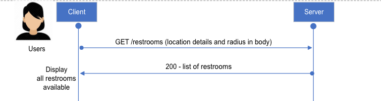
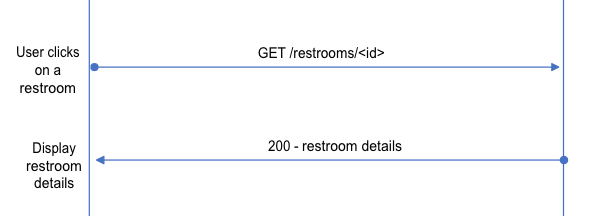
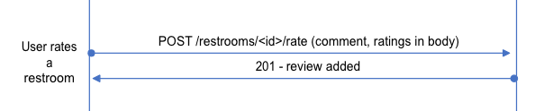
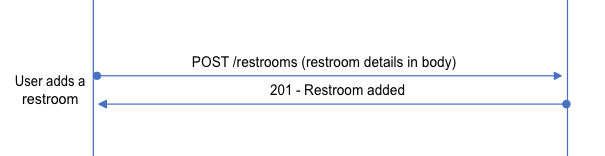

# Hight Level Design

## Scenarios

### 1. Display list of restrooms to users

Flow

1. Using user's location and distance filter, client makes a request to fetch all nearby restrooms
2. Server returns list of restooms
3. Client displays the list



Sample request body

```
{
    "location": {
        "latitude": 123456,
        "longitude": 123456,
        "city": "Hyderabad"
    },
    "distance": 1000
}
```

Sample response

```
200 OK
{
    "data": [
        {
            "id": 1,
            "name": "Sarath city capital",
            "location": {
                "latitude": "17.4576117",
                "longitude": "78.3639169",
                "city": "Hyderabad"
            },
            "imgSrc": "ams.com/example1",
            "rating": 4.5
        },
        {
            "id": 2,
            "name": "Inorbit mall",
            "location": {
                "latitude": "17.4343744",
                "longitude": "78.38442",
                "city": "Hyderabad"
            },
            "imgSrc": "ams.com/example2",
            "rating": 4
        },
    ]
}
```

### 2. User views restroom details

Flow

1. User clicks on a restroom
2. Client makes a request to fetch restroom's details
3. Server returns the restroom details
4. Client displays the restroom details



Sample request

```
GET /restrooms/1
```

Sample response

```
200 OK
{
    "data": {
        "id": 1,
        "name": "Sarath city capital",
        "imgSrc": "ams.com/example1",
        "rating": 4.5,
        "picUrls": ["ams.com/example1", "ams.com/example11"],
        "location": {
            "latitude": 123456,
            "longitude": 123456,
            "city": "Hyderabad"
        }
        "address": "Sarath city capital, Kondapur, Hyderabad",
        "phone": 123456789,
        "amenities": {
            "sanitaryNapkins": true,
            "dustbin": true,
            "clean": true,
            "handwash": true
        },
        "comments": [
            {
                "id": 3,
                "author": {
                    "name": "Test user",
                    "profilePicUrl": "ams.com/pp1"
                },
                "rating": 5,
                "comment": "Very neat with all amenities. :)"
            },
            {
                "id": 1,
                "author": {
                    "name": "Test user2",
                    "profilePicUrl": "ams.com/pp2"
                },
                "rating": 4,
                "comment": "Neat. But could be better!"
            }
        ]
    }
}
```

### 3. User rates a restroom

Flow

1. User enters a review comment
2. Client makes a request to server with user's comment and rating



Sample request

```
POST /restrooms/1/rate

{
    "author": {
        "name": "Test user3",
        "profilePicUrl": "ams.com/pp3"
    },
    "rating": 5,
    "comment": "Great!!"
}
```

Sample response

```
201 CREATED
```

### 4. User creates a new restroom

Flow

1. User enters restroom details
2. Client makes a request to server with restroom's details



Sample request

```
POST /restrooms

{
    "name": "Shah Ghouse",
    "imgSrc": "ams.com/example3",
    "rating": 3,
    "picUrls": ["ams.com/example3", "ams.com/example33"],
    "location": {
        "latitude": 654321,
        "longitude": 654321,
        "city": "Hyderabad"
    }
    "address": "Shah Ghosue, Kondapur, Hyderabad",
    "phone": 987654321,
    "amenities": {
        "dustbin": true,
        "handwash": true
    }
}
```

Sample response

```
201 CREATED
```
